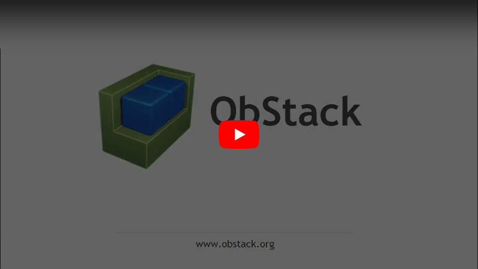

# ObStack

ObStack is an open source tool allowing a user to fully dynamically configure data object types, and manage the objects and data as suited. Both object configuration and data can be fully by managed by a web interface or the API. This allows ObStack to be used as CMDB / Configuration manager, asset manager, content manager, deployment manager, a quick and simple management portal or whatever application one may seem fit.

For more information visit <a href="https://www.obstack.org" target="_blank">https://www.obstack.org</a>.

## Project goals

* Functionality
* Flexibility
* Simplicity
* Security
* Open Source

There are a lot of great open source tools available for CMDB, Asset management and so on, capable of creating complex systems and supplying advanced features. However, in some cases an advanced and complex system is not required, and all you need is a simple and straight forward tool. The goal of the *ObStack* project is to try and fill a gap between spreadsheet sharing and the available more advanced solutions, and providing an interface for other solutions as suited along the way.

[](https://youtu.be/H8jDNsbyuf4)


# Installation

As one of ObStack's goals the installation is easy to setup using a basic linux webserver setup with PostgreSQL, as described below.

Obstack also supplies a <a href="https://github.com/obstack-org/obstack-docker" target="_blank">docker</a> image and a docker-compose script for easy deployment.

## Requirements

* Linux server
* Web server (Apache2, NGINX)
* PHP >= v7.4 _**with** pdo package_
* PostgreSQL >= v11 _**with** contrib package_

## Basic example (AlmaLinux8/Rocky8)

_(The database security used in this example is for demo purposes only)_

```bash
# Install packages
sudo dnf -y module disable php postgresql
sudo dnf -y module enable php:7.4 postgresql:12
sudo dnf -y install httpd php php-pdo php-pgsql postgresql-server postgresql-contrib sudo git

# Setup Apache2
sudo setsebool -P httpd_can_network_connect_db on
sudo systemctl enable httpd && sudo systemctl start httpd
sudo firewall-cmd --permanent --zone=public --add-service=http
sudo firewall-cmd --permanent --zone=public --add-service=https
sudo firewall-cmd --reload

# Setup PostgreSQL
sudo postgresql-setup --initdb
sudo sed -i '/^# TYPE/a\\n# ObStack\nhost\tobstack\t\tobstack\t\t127.0.0.1/32\t\tmd5\nhost\tobstack\t\tobstack\t\t::1/128\t\t\tmd5' /var/lib/pgsql/data/pg_hba.conf
sudo systemctl enable postgresql && sudo systemctl start postgresql
sudo -u postgres bash -c "cd; createdb obstack; psql -c \"CREATE USER obstack WITH PASSWORD 'obstack'; GRANT CONNECT ON DATABASE obstack TO obstack;\""

# Setup ObStack
cd /var/lib
sudo git clone "https://github.com/obstack-org/obstack.git"
sudo -u postgres psql obstack </var/lib/obstack/resources/obstack-schema-v1.sql
sudo -u postgres bash -c "cd; psql obstack -c \"GRANT ALL PRIVILEGES ON ALL TABLES IN SCHEMA public TO obstack; GRANT ALL PRIVILEGES ON ALL SEQUENCES IN SCHEMA public TO obstack;\""
sudo ln -s /var/lib/obstack/webapp /var/www/html/obstack
```

Now login to your new installation on [http://yourserver/obstack](http://yourserver/obstack) with default authentication: _admin_/_admin_.
# Documentation

Main documentation:

* General
  * [Installation](./docs/obstack-installation.md)
  * [Configuration](./docs/obstack-configuration.md)
* API Reference
  * [/auth](./docs/api-auth.md)
  * [/objecttype](./docs/api-objecttype.md)
  * [/valuemap](./docs/api-valuemap.md)

For the full documentation please visit <a href="https://www.obstack.org/docs/" target="_blank">https://www.obstack.org/docs/</a>.
