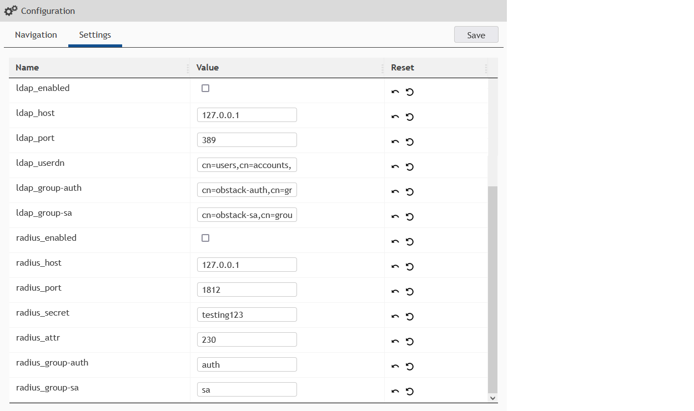
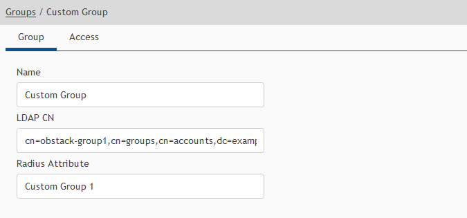

# Configuration

* [Base configuration](#base-configuration)
* [Database schema](#database-schema)
* [Additional configuration](#additional-configuration)
* [Configuring recoverable passwords](#configuring-recoverable-passwords)
* [Configuring external authentication](#configuring-external-authentication)
  * [Group matching (for LDAP/Radius)](#group-matching-for-ldapradius)
  * [Radius attribute configuration](#radius-attribute-configuration)
* [Upgrade notes](#upgrade-notes)

### Base configuration

***NOTE!!:*** _When upgrading from an older version, see: [Upgrade notes](#upgrade-notes)_

Requirements:
* Base configuration is stored in a text file
  * For security purposes this file ***must*** be stored outside _public_html_
  * Make sure the web server has read only access to this file
  * Default path: _/etc/obstack/obstack.conf_
* Path to the configuration file is configured in _config.php_.

#### obstack.conf

```bash
db_connectionstring = pgsql:host=127.0.0.1;dbname=obstack;user=obstack;password=obstack
# sc_encryptionkey =
# debug = false
```

#### config.php

```php
<?php
$obstack_conf = '/etc/obstack/obstack.conf';
```

# Database schema

As described in the installation instruction, the database schema needs to be imported manually.

Local installation:

```bash
# New setup
cat /var/lib/obstack/resources/obstack-schema-v1.sql | sudo -u postgres psql obstack
# Upgrade from v1.1.x
cat /var/lib/obstack/resources/obstack-update-v1.2.0.sql | sudo -u postgres psql obstack
```

Or when using the <a href="https://github.com/obstack-org/obstack-docker" target="_blank">docker</a> image:

```bash
# New setup
curl -s https://raw.githubusercontent.com/obstack-org/obstack/main/resources/obstack-schema-v1.sql \
  | docker exec -i obstack-db psql -U obstack obstack
# Upgrade from v1.1.x
curl -s https://raw.githubusercontent.com/obstack-org/obstack/main/resources/obstack-update-v1.2.0.sql \
  | docker exec -i obstack-db psql -U obstack obstack
```

### Additional configuration

Additional configurations can be managed in the WebUI under _Configuration_:
* Navigation
  * Configure the sidebar navigation tree
* Settings
  * The application display name
  * The CSS color scheme
  * Session timeout
  * Default OTP settings for new users
  * LDAP server configuration
  * Radius server configuration

### Configuring recoverable passwords

Recoverable passwords are stored and retrieved encrypted. To enable this feature set _sc_encrytionkey_:

* Enable _sc_encrytionkey_ in the base configuration file, or as environment variable when using <a href="https://github.com/obstack-org/obstack-docker" target="_blank">docker</a>
* Set _sc_encrytionkey_ to a random string of charcters, peferably consisting of upper case and lower case characters, numbers and symbols
* _sc_encrytionkey_ requires a ***minimal length*** of ***12***
* Make sure to backup the configured encryption key somewhere safe. When losing this key it is ***impossible to retrieve any of the encrypted data!***

#### obstack.conf

```bash
sc_encryptionkey =
```

### Configuring external authentication

When implementing LDAP and/or Radius authentication please note:

* Authentication will commence in the following order: LDAP, Radius, Database
* When authentication fails on a step, it will try authenticating with the same parameters on the next step. Authentication will fail if all methods have failed.
* Access is allowed when the LDAP/Radius user is member of the configured group or atttribute as configured in _group-auth_.
* Likewise, SuperAdmin permissions require membership of the group configured in _group-sa_.
* User tokens are primarily designed for usage by dedicated API users. Tokens for LDAP/Radius users is not yet supported.
* Radius support requires package _php-pecl-radius_

LDAP and/or Radius can be configured under _Configuration_ > _Settings_



#### Group matching (for LDAP/Radius)

Groups can have an _ldapcn_ or _radiusattr_ value configured. Users authenticated by LDAP or Radius will automatically inherit a group's permissions when exactly matching these configurations.
* LDAP: Matching the full DN, e.g.: _cn=mygroup-auth,cn=groups,cn=accounts,dc=example,dc=local_
* Radius: Matching name in the attribute's string



And last, but not least:
* LDAP support has been developed and tested _only_ with freeIPA
* Radius support has been developed and tested _only_ with freeradius, and is no longer available in PHP 8

#### Radius attribute configuration

While Radius is not meant for this kind of application it may still be nice to have. Since there is no such thing as groups in Radius, matching groups is still supported by adding a comma separated list of group names/tags as a Radius attribute. A small description:

Mase sure the configured attribute id matches the entry in your freeradius dictonary

FreeRADIUS:

_/etc/raddb/dictionary_

```javascript
ATTRIBUTE    MyAppGroups    230    string
```

_/etc/raddb/sites-enabled/default_ > _post-auth_

```javascript
update reply {
  MyAppGroup = "auth, sa, Custom Group 1"
}
```

### Upgrade notes

The upgrade to _1.2.0_ from a lower version implements a significate change in the way ObStack handles configuration ([Base configuration](#base-configuration)). These changes can be easily handled following these steps:

* Copy the new <a href="https://github.com/obstack-org/obstack/blob/main/resources/obstack.conf" target="_blank">config file</a> to a location outside _public_html_, e.g. to (default) _/etc/obstack/obstack.conf_. Ensure the web server has read only access to this file.
* Copy the content of db_connectionstring from _config.php_ to the new config file (see [obstack.conf](#obstackconf))
* Configure _sc_encryptionkey_ as stated at [Configuring recoverable password](#configuring-recoverable-passwords)
* Browse to your ObStack instance. Your current configuration will be copied to the database autmatically, and show a configuration error message
* Edit config.php, set variable _$obstack_conf_ pointing to the new configuration file, and remove all other lines
```php
<?php
$obstack_conf = '/etc/obstack/obstack.conf';
```
* The upgrade is completed. Browse to / refresh your ObStack instance page to continue working with ObStack
