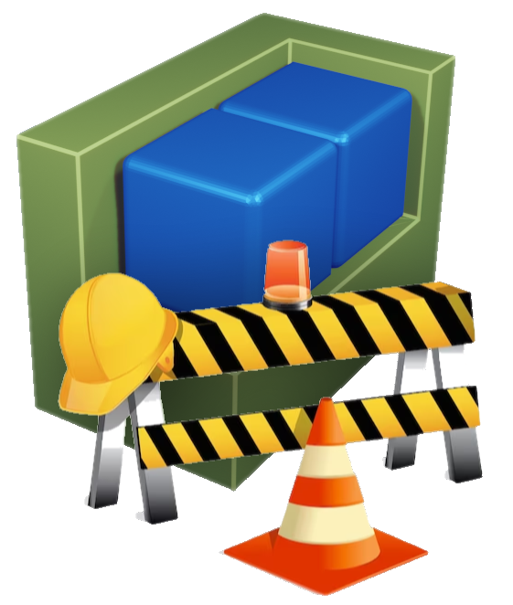

# Configuration

At this moment this page contains only a quick summary of the primary configuration options.\A more detailed version is still...
<div style="padding-left: 250px;">\**Under construction**</div>

#### Database

config.php
```
$db_connectionstring = 'pgsql:host=127.0.0.1;dbname=obstack;user=obstack;password=obstack';
```

#### Display name

js/obstack.js
```
const title = 'ObStack';
```

#### Authentication options

config.php
```
$sessman_config = [

  'timeout'  => 600,

  'ldap'    => [
    'enabled'       => false,
    'host'          => '127.0.0.1',
    'port'          => 389,
    'userdn'        => 'cn=users,cn=accounts,dc=example,dc=local',
    'group-auth'    => 'cn=obstack-auth,cn=groups,cn=accounts,dc=example,dc=local',
    'group-sa'      => 'cn=obstack-sa,cn=groups,cn=accounts,dc=example,dc=local'
  ],

  'radius'  => [
    'enabled'       => false,
    'host'          => '127.0.0.1',
    'port'          => 1812,
    'secret'        => 'testing123',
    'attr'          => 230,
    'group-auth'    => 'auth',
    'group-sa'      => 'sa'
  ],

];
```
